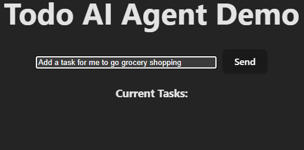
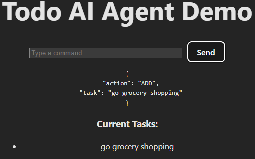
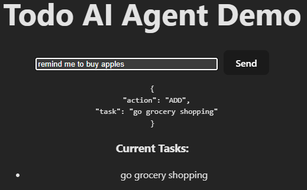
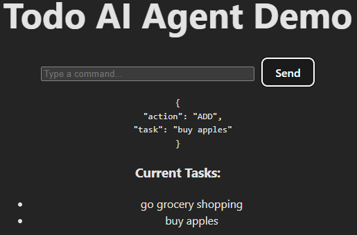
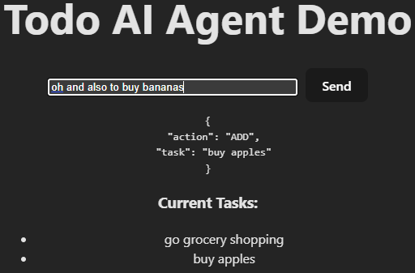
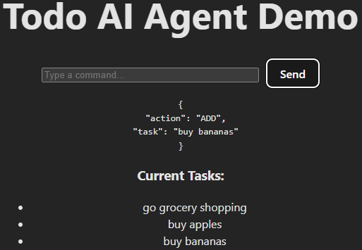

# 📝 Todo Agent Demo

> **Todo Agent Demo** is a lightweight showcase of AI agent concepts, built to illustrate the classic **Perceive → Plan → Act → Reflect** loop in a simple task‑list environment.  
>  
> This project is intended purely for **learning, experimenting, and sharing** — not as a production system.  
>  
> Use it as a starting point for your own experiments, a teaching aid for workshops, or a portfolio example to demonstrate agent architecture in action.


---

## 🚀 Features
- **Perceive**: Accepts natural language input (e.g., "Add a task to buy groceries").
- **Plan**: Uses an LLM to decide whether the request is `ADD`, `REMOVE`, or `LIST`.
- **Act**: Updates a simple in-memory task list.
- **Reflect**: Confirms the action and shows the updated list.

---

## 📸 Demo Screenshots
| Prompt | Result |
|--------|--------|
|  |  |
|  |  |
|  |  |


## 📂 Project Structure
```
/todo-ai-agent
├── backend/        # Express + agent logic
│   ├── index.js
│   ├── server.js
│   ├── package.json
│   └── .env.local
├── frontend/       # React + Vite UI
│   ├── src/
│   ├── public/
│   ├── package.json
│   └── index.html
├── resources/      # screenshots, docs
│   ├── README.md
│   └── images/
└── package.json    # root scripts + concurrently
```
## 🔒 Environment Files & Git Safety
This project uses environment files for configuration:

- `.env` → safe defaults (model name, log level, etc.)
- `.env.local` → sensitive values (API keys, tokens)

⚠️ **Important:** `.env.local` is ignored via `.gitignore` and should never be committed.

---

## ⚙️ Setup & Run
1. Clone the repo:
   ```bash
   git clone https://github.com/your-username/todo-ai-agent.git
   ```
2. Install root dependencies
   (this sets up `concurrently` and root scripts)
   ```bash
   npm install
   ```
3. Install frontend + backend dependencies
   ```
   npm run install:all
   ```
4. Configure environment variables
   - Copoy `.env.example` -> `.env.local` inside **backend/**
   - Add your OpenAI API key:
   ```env
   OPENAI_API_KEY=sk-your-secret-key
   OPENAI_MODEL=gpt-4o-mini
   ```
5. Run in development mode
   ```
   npm run dev
   ```
   * /backend runs on port 5000
   * /frontend runs on port 5173
   


